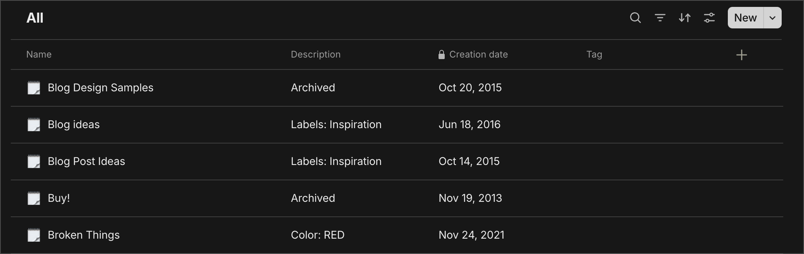

# CLI tool for converting Google Keep exports to any-block objects for Anytype

## Setup

Run: `yarn` to install dependencies.

Optional: create a tag in anytype and set `TAG_ID` in `.env` to the tag id.
This will tag all converted notes with the given tag.
You can find the tag id by exporting an anytype object with the tag as `Any-Block` type and looking at the `tags` field in the exported json.

Export your Google Keep data from [Google Takeout](https://takeout.google.com/settings/takeout) and unzip it.

## Usage

Run:
`yarn cli -p <path-to-keep-folder>/Takeout/Keep/ -o <output-folder>`

## CLI Options

- `-p` or `--path` - Path to the Google Keep folder
- `-o` or `--output` - Path to the output folder (will be created if it doesn't exist and must be different from the input folder)
- `-a` or `--archive` - Whether to include archived notes. Defaults to `false`.
- `-t` or `--trash` - Whether to include trashed notes. Defaults to `false`.
- `-m` or `--mode` - Mode for conversion. Can be `pages` or `mixed`. Defaults to `mixed`. `mixed` mode will convert Keep notes with titles to Anytype `page` and Keep notes without titles to Anytype `note`. `pages` mode will convert all Keep notes to Anytype `page`, and will use the created date as the title if the Keep note does not have a title.
- `-e` or `--emoji` - The emoji to use for the Anytype object. Defaults to nothing.
- `-d` or `--metadata` - Whether to include additional metadata from Google Keep. Defaults to `false`. Refer to Notes for more information.
- `-r` or `--relation` - Include the description relation as a block in the Anytype object. Defaults to `false`.

## Import

In anytype, select `file -> import` then `Any-Block` and select the output folder to bulk import.

## Notes

- You should try importing into a blank space first to see if the conversion works as expected.
- Does not import Google Keep images
- Modifies the created and modified dates to match the Google Keep note
- If the Keep note does not have a title, it uses the created date as the title
- Automatically parses any hyperlinks or annotations
- Metadata will be included in the description if the `metadata` flag is set to `true`. This metadata includes:
  - `Color` - The colour of the note if it's not DEFAULT
  - `IsPinned` - Whether the note is pinned
  - `IsArchived` - Whether the note is archived
  - `IsTrashed` - Whether the note is in the trash
  - `Labels` - The labels attached to the note

## Example

`yarn cli -p <path-to-keep-folder>/Takeout/Keep -o <output-folder> -a -t -d -r -m pages -e 🗒️`

In this example, the command above was run. This includes all archived notes and adds the labels and colours of the notes in the Description relation. The creation dates also match the original Google Keep notes.

